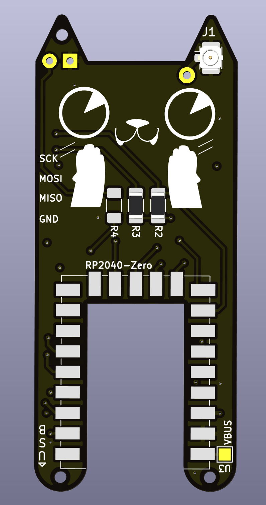
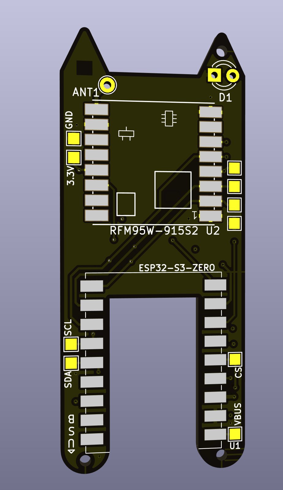
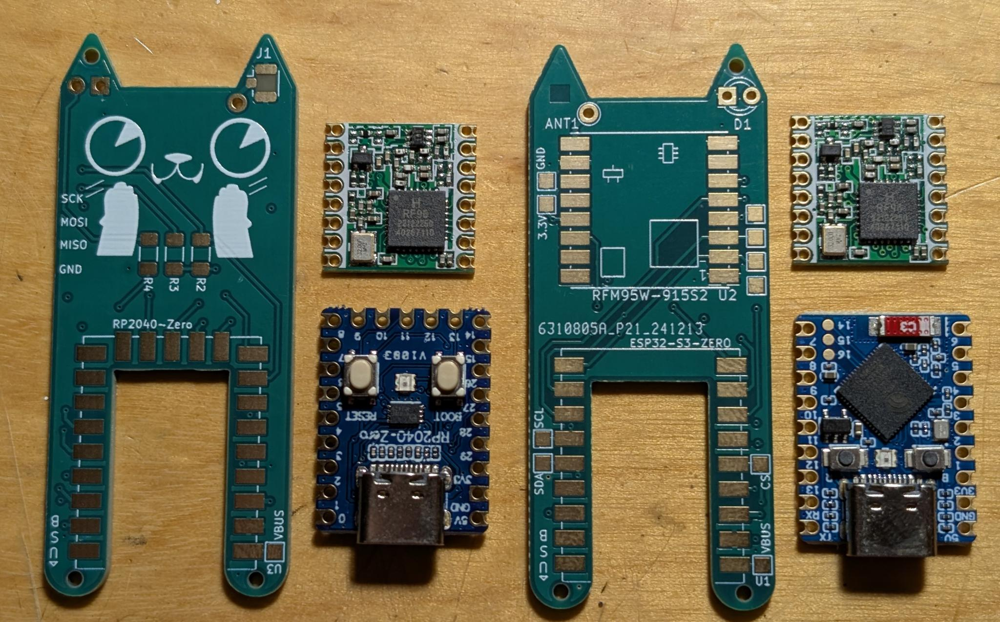
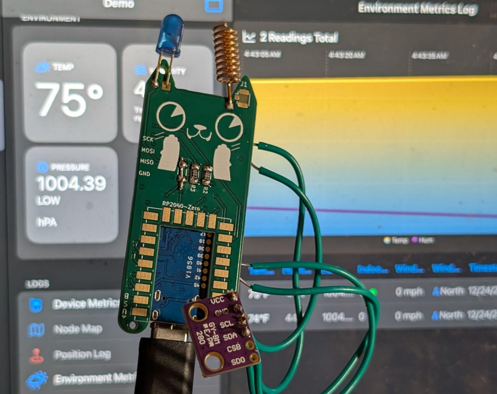
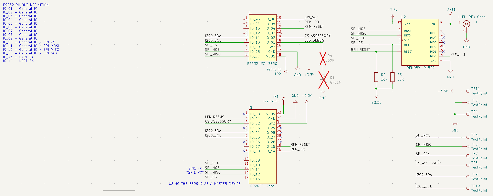

# Nibble
Open Source Nibble Release

Follow the guide here:

Meshtastic Config (Compile your own firmware)

RP2040: https://github.com/Sparkling-Ice/retia-boards/tree/main/variants/nibble_rp2040

ESP32s3: https://github.com/Sparkling-Ice/retia-boards/tree/main/variants/nibble_esp32

# LoRa Nibble  

The **Nibble** is a small, open source LoRa radio node designed to be your first piece of off-grid infrastructure. It was created by **Kody Kinzie and the Retia team (Zac Beran, Felix Orozco)** for the 2024 Chaos Communication Congress in Germany and released as open hardware at the 2025 Hackers On Planet Earth conference.  

Over **500 Nibbles have been made** worldwide, and the design is shared here so you can build your own. The board is sized to fit inside a **1 inch PVC pipe**, making it easy to weatherproof and deploy as a permanent or portable infrastructure node.  

---

## Features  
- Fits inside standard 1 inch PVC pipe for protection and mounting  
- Works with **Meshtastic** for off-grid communication  
- Supports either **ESP32-S3** (Wi-Fi/Bluetooth) or **RP2040** (low power) microcontrollers  
- Uses **RFM95 LoRa modules** (868 MHz EU or 915 MHz US)  
- Expandable with I²C sensors for telemetry  
- Supports private channels, GPS sharing, and sensor reporting  
- Open source hardware and firmware  

---

## Bill of Materials  
- 1x Nibble PCB (order from JLCPCB, PCBWay, OSH Park, etc.)  
- 1x Microcontroller (ESP32-S3 or RP2040)  
- 1x RFM95 LoRa radio module (868 MHz or 915 MHz)  
- 1x Spring antenna or U.FL connector and external antenna  
- 1x 330 Ω resistor  
- 2x 10k Ω resistors  
- 1x LED indicator  

**Tools required:** soldering iron, solder, tweezers or pliers, and a laptop with USB-C cable.  

---

## Assembly Instructions  
1. Solder the **resistors** (330 Ω and two 10k Ω).  
2. Install the **microcontroller** into the designated footprint. Only one microcontroller can be used at a time.  
   - Use ESP32-S3 if you want Bluetooth and Wi-Fi connectivity.  
   - Use RP2040 if you want a lower power build for solar or battery use.  
3. Solder the **LoRa radio module**. Align it carefully with the silkscreen outline.  
4. Solder the **antenna connector**. Use either the spring antenna or the U.FL connector, not both.  
5. Solder the **LED indicator**. The negative leg goes to the square pad.  

⚠️ **Important:** Always connect an antenna before powering or transmitting. Running the board without one can permanently damage the radio.  

---

## Firmware Installation  

### ESP32-S3   
1. Visit [nugget.dev](https://nugget.dev).  
2. Hold the **BOOT** (B) button while plugging in the board.  
3. Select your Nibble from the device list.  
4. Select the Nibble Meshtastic firmware from the list.  
5. Once uploaded, unplug and reconnect the board.  

### RP2040  
1. Download the `.uf2` firmware from the Retia GitHub release page.  
2. Hold the **BOOTSEL** button while plugging in the board.  
3. The board mounts as a USB drive.  
4. Drag and drop the `.uf2` file onto the drive. The board will reboot automatically.  

---

## Meshtastic Setup  
1. Connect to the Nibble using the **Meshtastic app** or via **USB serial**.  
   - Bluetooth default PIN (ESP32 only): `123456`.  
2. Set your **region** (US915 or EU868).  
3. Give the device a **short name** and **long name**.  
4. Join or create a **private channel**. You can share access with friends using QR codes.  

---

## Example Uses  
- Off-grid communication at festivals or protests  
- Emergency infrastructure during natural disasters  
- Remote telemetry for weather stations  
- GPS tracking in outdoor environments  
- Long range remote control or IoT projects  

---

## Community and Resources  
- Flashing Firmware: [GitHub Releases](https://nugget.dev)  
- Meshtastic documentation: [meshtastic.org](https://meshtastic.org)  
- Community projects and support: [Retia Discord](https://discord.gg/cJHNswdSTz)

### Project Images

#### Front & Back

#### Kit & Sensor

#### Schematic

